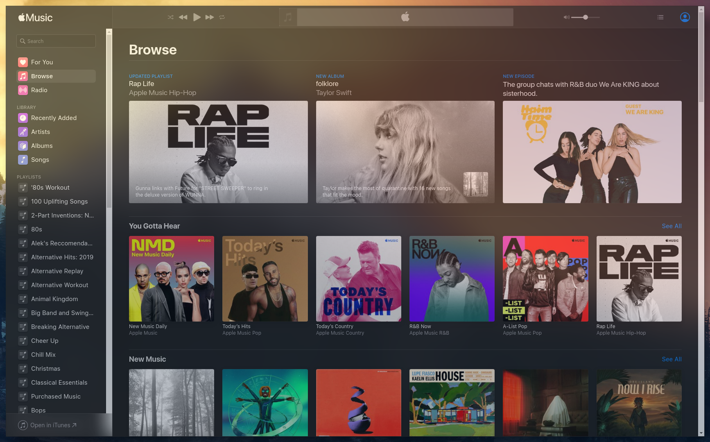

# Introduction

This is an unofficial version of Apple Music's web page packaged as an Electron App. It looks cleaner on a Desktop than the website.

After seeing [puneetsl's Lotion repository](https://github.com/puneetsl/lotion), I thought I'd give using `nativefier` a go. This entire repo is essentially just a slight reworking of his, so full credit to him.

Screenshot:



*Note: The transparency is not part of the app, it's from the compton-tyrone compositor.

# Installation

Simply clone this repo and run

```bash
./install.sh
```

-------


# Uninstall

```bash
./uninstall.sh
```
